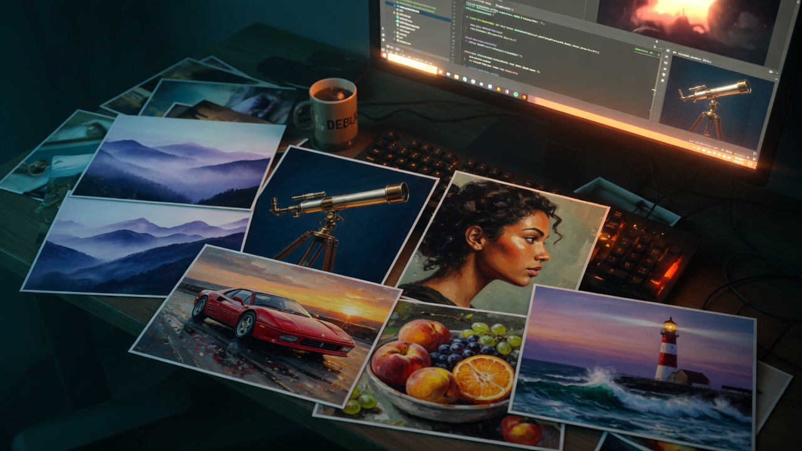
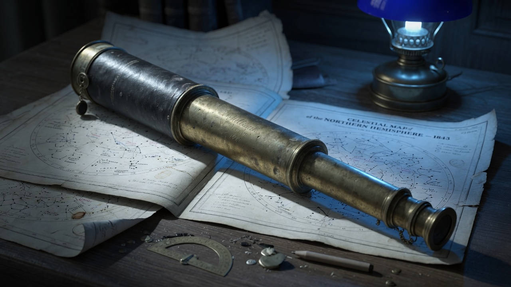
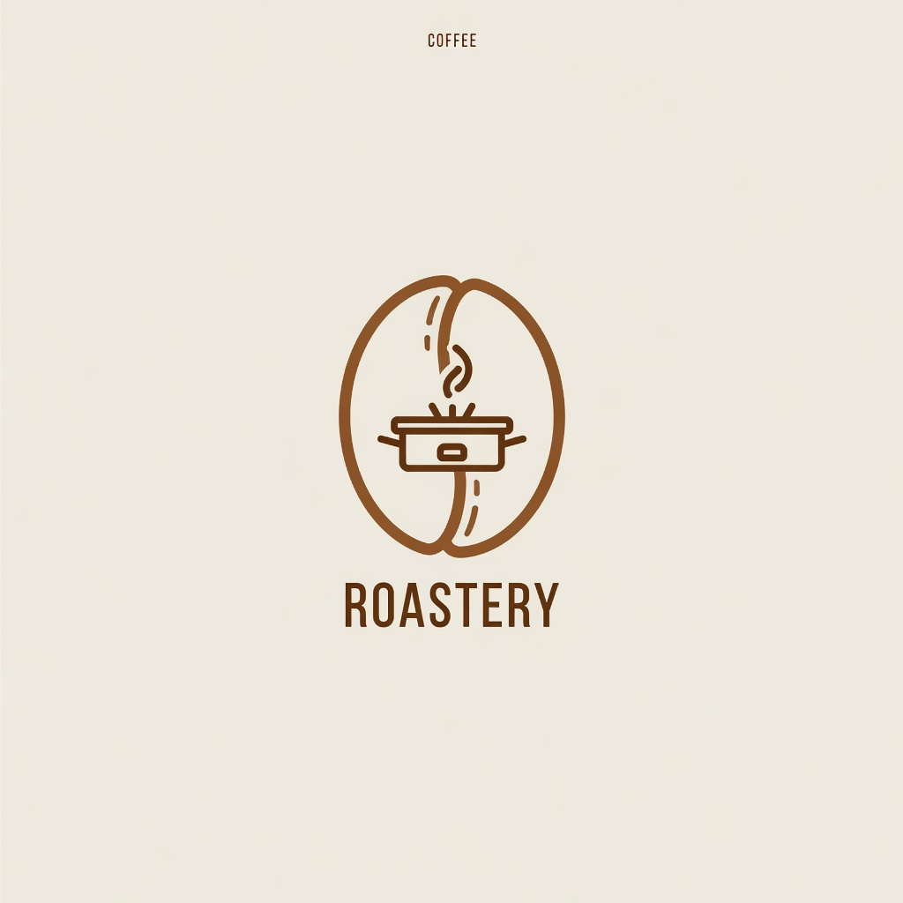
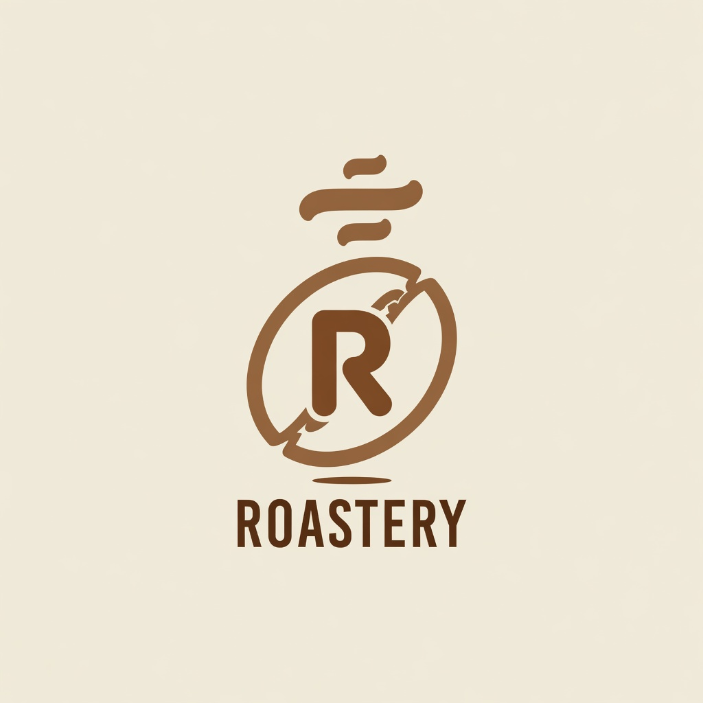

# Grok plugin for Claude Code



<sub>Every image in this README was generated by the plugin. This one: `/grok:image A developer's desk at night lit only by the glow of a monitor… --aspect 16:9`</sub>

Generate and edit images and video with the [Grok CLI](https://x.ai/build) without leaving Claude Code, and finish them with local tools: last frame, join, mute, reframe, exact text overlays, cut-outs. It also installs in Codex and in Grok itself, which read the same plugin format.

Built in the shape of [`openai/codex-plugin-cc`](https://github.com/openai/codex-plugin-cc), which does the same thing for Codex code review and delegation.

## Fork notes

This is [`madebysandro/grok-plugin-cc`](https://github.com/madebysandro/grok-plugin-cc), a fork of [`arielaizn/grok-plugin-cc`](https://github.com/arielaizn/grok-plugin-cc) by **Ariel Aizenshtat**, who wrote the original plugin (1.0.0). The fork keeps its MIT license and copyright notice.

Version 2.0.0 is the fork's first release. It aims for the experience of the Higgsfield skills (a few generation commands, local tools that need no AI, and a router skill Claude follows) on a Grok subscription alone, through the Grok CLI, with no API key. Over 1.0.0 it adds:

- `/grok:ref-video`, for `reference_to_video`: consistent people and products from reference images, exact first and last frames, keyframes, preset voices, seamless loops.
- Seven local tools that call no Grok and spend no quota: `last-frame`, `concat`, `mute` and `reframe` (ffmpeg), `overlay` (headless Chrome), `cutout` and `split` (Python).
- Image 2.0 (`grok-imagine-image-2.0`) by default, which renders short text with accents correctly, with `--image-model` to switch.
- Options checked before Grok runs, so a value the tool would reject costs nothing. Video asks for 720p, and `--draft` gives a cheap 480p try-out.
- Isolated media runs: each command offers Grok only the tool it needs and leaves out your Claude and Cursor setup. That cut one image's tokens by more than half, and a recursion guard keeps Grok from calling back into the plugin.
- `@last` and `job:<id>[#N]` as inputs, to chain one result into the next command.
- Zero-cost compatibility checks in `/grok:setup`, which read the sessions Grok left on disk and never start a run.
- The `grok-generate` router skill, which acts only when you ask for Grok by name.
- Foreground runs by default, and a one-time note when media lands in a folder git would pick up.

Every change is in the [CHANGELOG](plugins/grok/CHANGELOG.md). The design notes are in [`docs/spec-paridade-higgsfield.md`](docs/spec-paridade-higgsfield.md) (in Portuguese), and every live generation made while building 2.0.0 is logged in [`docs/live-tests.md`](docs/live-tests.md).

## Commands

| Command | What it does | Runs |
| --- | --- | --- |
| `/grok:image` | Generate images with `image_gen` (Image 2.0 by default) | Grok |
| `/grok:edit` | Edit an existing image, or combine several, with `image_edit` | Grok |
| `/grok:video` | A video from a description: an `image_gen` still, then `image_to_video` | Grok |
| `/grok:animate` | Animate a still you already have with `image_to_video` | Grok |
| `/grok:ref-video` | A video from reference images, pinned first/last frames, keyframes and preset voices (`reference_to_video`) | Grok |
| `/grok:ask` | Delegate a general task to Grok (read-only unless `--write`) | Grok |
| `/grok:last-frame` | Save a clip's last frame as a PNG, to start the next clip from it | ffmpeg |
| `/grok:concat` | Join clips end to end | ffmpeg |
| `/grok:mute` | Drop a clip's soundtrack | ffmpeg |
| `/grok:reframe` | Crop, or pad on a blurred copy, an image or a video to another aspect ratio | ffmpeg |
| `/grok:overlay` | Exact text over an image, set in HTML at the image's size, optionally from a `brand.json` | Chrome |
| `/grok:cutout` | Clear a green-screen background to transparency | Python |
| `/grok:split` | Split a sheet (turnaround, product grid, icon set) into one transparent PNG per item | Python |
| `/grok:setup` | Check the CLI is installed and signed in, the plan, and what it can generate, at no cost | local |
| `/grok:status` | List this workspace's jobs | local |
| `/grok:result` | Show a job's files and notes | local |
| `/grok:cancel` | Cancel a running job | local |

The Grok commands draw on your plan's quota. The others run on this machine and cost nothing.

Plus the `grok-media` subagent for multi-asset work, and four skills: `grok-generate` (the router: which command, which options, the real limits), `grok-cli-runtime` (how the plugin drives the CLI), `grok-imagine-prompting` (prompt craft, `ref-video` tags, staging for cut-outs) and `grok-media-results` (checking a result before reporting it).

## Requirements

- **Grok CLI**, signed in: install it from [x.ai/build](https://x.ai/build), then run `grok login`. Runs count against your xAI account; on a Grok subscription they draw on the plan's weekly pool.
- **Node.js 18.18+**
- Optional, for the local tools. Nothing is installed for you, and a missing one is named when a tool needs it:
  - **ffmpeg** (with ffprobe) for `last-frame`, `concat`, `mute` and `reframe`.
  - **Python 3 with Pillow, numpy and scipy** for `cutout` and `split`. `GROK_PLUGIN_PYTHON` picks another interpreter than the `python3` on your PATH.
  - **Google Chrome or Chromium** for `overlay`. The plugin looks for the macOS app, then `google-chrome` or `chromium` on the PATH; `CHROME_PATH` points it at a specific binary.

## Install

In Claude Code:

```
/plugin marketplace add madebysandro/grok-plugin-cc
/plugin install grok@grok-plugin-cc
/reload-plugins
/grok:setup
```

In Codex:

```bash
codex plugin marketplace add https://github.com/madebysandro/grok-plugin-cc
codex plugin add grok
```

## Usage

```bash
/grok:image a vintage brass telescope on a wooden desk beside an open star chart, warm lamplight --aspect 16:9 --name telescope
/grok:edit  change the lamp glass to deep blue and cool the scene to moonlight --image @last
/grok:animate slow push-in, dust drifting through the light --image @last --draft
/grok:reframe @last --aspect 9:16 --mode pad
/grok:overlay --image grok-media/telescope-1.jpg --text 'Star Party' --sub 'Friday, 9 pm'
/grok:ref-video '<IMAGE_0> on a white table, the camera circles it slowly' --image grok-media/telescope-1.jpg --duration 4 --draft
/grok:ask   what would break if we moved session state into Redis?
```

Files land in `grok-media/` by default (`--out` to change it). They are named from the prompt, the input file or `--name`, numbered, and never overwritten. A `grok-manifest.json` records, for each file, the prompt actually sent, the tool that made it, and the aspect ratio, duration, resolution, draft flag, image model and cost reported for the run.

Every command's output names its job. Any file input takes `@last` (the last file the plugin saved in this workspace, by a generation or a local tool), `job:<id>` (that job's first file) or `job:<id>#N`. A `video` job holds the still and the clip, so `job:<id>#1` is the still.

With the plugin installed, you can also just ask Claude, as in "use Grok to make a 9:16 clip of…". The `grok-generate` skill picks the command and runs it. It only acts when you name Grok, so a generic "make a video" is left to whichever tool you choose.

### Generate, then edit

`image_edit` changes only what you name and leaves the rest of the frame alone, which is why iterating means editing rather than re-generating. Here the second command changed the lamp and the grade; the telescope, the charts, the pencil and the scattered brass fittings all stayed exactly where they were.

<table>
<tr>
<td width="50%"></td>
<td width="50%"></td>
</tr>
<tr>
<td><sub><code>/grok:image a vintage brass telescope on a wooden desk beside an open star chart, warm lamplight, shallow depth of field --aspect 16:9</code></sub></td>
<td><sub><code>/grok:edit change the lamp glass to deep blue and cool the whole scene to moonlight, keep everything else identical --image grok-media/telescope-1.jpg</code></sub></td>
</tr>
</table>

### Variations

`--count` runs `image_gen` several times over one subject. There is no seed, so these are genuinely different takes rather than nudges of the same image. That helps with concepting, and it is why a *recurring* subject has to come from editing a base image, or from `/grok:ref-video` with that image as a reference.

<table>
<tr>
<td width="50%"></td>
<td width="50%"></td>
</tr>
<tr>
<td colspan="2"><sub><code>/grok:image a minimalist flat-vector logo mark for a coffee roastery, single warm-brown color on cream --count 2 --aspect 1:1</code></sub></td>
</tr>
</table>

### Options

| Option | Meaning |
| --- | --- |
| `--out DIR` | Output directory (default `grok-media/`) |
| `--name SLUG` | Filename stem |
| `--aspect RATIO` | `image`/`video`: `1:1`, `16:9`, `9:16`, `3:2`, `2:3`, `auto`. `edit` takes a wider set, and only with 2+ images. `ref-video`: `1:1`, `16:9` (default), `9:16`, `4:3`, `3:4`, `3:2`, `2:3`. `animate` keeps the source's shape. `reframe` takes any `W:H` |
| `--count N` | `image`/`edit`: number of results, 1–8 |
| `--image PATH` | Input image of `edit` (repeatable), `animate`, `ref-video` (repeatable: the references) and `overlay`. Takes a path, `@last` or `job:<id>[#N]` |
| `--image-model M` | `image`/`edit`/`video`: `2.0` (default, `grok-imagine-image-2.0`), `quality`, `standard`, or `server` for xAI's current default |
| `--duration SECS` | `animate`/`video`: `6` (default) or `10`. `ref-video`: 1–15 (default 6) |
| `--resolution R` | `animate`/`video`/`ref-video`: `720p` (default) or `480p` |
| `--draft` | `animate`/`video`/`ref-video`: the 480p tier, 6 s unless `--duration` says otherwise |
| `--background` | In a slash command, have Claude run the generation as a background job (see `/grok:status`) instead of waiting for it |
| `--model` · `--effort` | Grok model and reasoning effort |
| `--timeout SECS` | Run timeout: 30–3600 for Grok runs; `overlay` takes 1–600 (default 60) |
| `--json` | Machine-readable output |
| `--verbatim=false` | Let Grok rewrite your prompt instead of passing it through |

`ref-video` has its own inputs (`--first-frame`, `--last-frame`, `--keyframe PATH@SECONDS`, `--voice ID`, `--loop`), and each local tool has a few options of its own. They are listed in each command's argument hint and by `node plugins/grok/scripts/grok-companion.mjs help`. A command refuses an option that does not apply to it, before anything runs.

## Real limits

Measured on Grok CLI 1.0.41 (see [`docs/live-tests.md`](docs/live-tests.md)), and enforced before Grok runs wherever the plugin can.

| | |
| --- | --- |
| **Images** | About 1K: 1024×1024 square, 1280×720 wide. One image per tool call; `--count` makes several calls. |
| **Edit references** | `image_edit` reduces every source image to about 768 px (~400 KB) before using it, so small text or a fine logo in a reference can be lost. Add exact text afterwards with `/grok:overlay`. |
| **Video resolution** | 720p or the 480p tier, nothing higher. 720p came out a real 1280×720 from a 16:9 still. "480p" is a tier, not 480 lines: `image_to_video` gave 736×400 from a 1280×720 still, and `reference_to_video` gave 848×480 at 16:9. 1080p is refused by the CLI itself (`resolution_name must be one of: 480p, 720p`); a plan's 1080p applies to the Grok app. |
| **Video length** | `animate` and `video`: 6 or 10 s. `ref-video`: 1–15 s. |
| **Sound** | Every clip is H.264 at 24 fps with an AAC soundtrack, always, plus an MJPEG cover picture as a second video stream. `/grok:mute` gives a silent copy. |
| **`ref-video` inputs** | The schema allows up to 14 reference images (7 on older CLIs, which `/grok:setup` detects); 8 were accepted live. Up to 3 preset voices (`eve` spoke a Portuguese line intelligibly) and 4 keyframes. |
| **Time** | An image takes 15–35 s and a clip 45–65 s. |
| **Not available** | 1080p or 4K video, 2k images, native video editing or extension, stand-alone speech or music, cloned voices, 3D, seeds, negative prompts. |

## Grok plugin vs Higgsfield

A short comparison with the Higgsfield skills for Claude Code, as they describe themselves in September 2026. This plugin trades range and ceiling for running on a subscription you may already have.

| | This plugin (Grok CLI) | Higgsfield skills |
| --- | --- | --- |
| **What you pay with** | The Grok subscription's weekly pool, shared with Chat, Imagine, Voice and Build. No API key. | Higgsfield credits, per generation |
| **Models** | Grok Imagine only: Image 2.0 for stills, Grok's video tools | Many: GPT Image 2.5, Nano Banana, Soul, Seedance, Kling, Veo and others |
| **Video ceiling** | 720p; 6 or 10 s from a still, 1–15 s from references | Seedance 2.5 up to 1080p and 4–30 s; 4K with Seedance 2.0 |
| **Consistency** | Reference images, pinned first/last frames and keyframes in `ref-video`; edits from a base image | Soul ID (a trained identity), reference-driven models |
| **Audio** | Preset voices, only inside a `ref-video` clip | Stand-alone audio: voice, music-like audio and sound effects |
| **Video editing** | None native. Last frame → new clip → `concat`, and `reframe`, run locally | Edit, extend and reframe workflows |
| **Exact text** | Image 2.0 for short text, `/grok:overlay` for anything that must be exact | GPT Image 2.5 for on-image text |
| **Beyond that** | `cutout` and `split` locally | 3D, ad and product-photo studios, marketplace cards, thumbnails, Virality Predictor |
| **Where results go** | Files in your workspace, with a manifest | Hosted URLs |

## Things worth knowing

**Your prompt is passed through verbatim.** Grok's bundled `imagine` skill otherwise rewrites prompts, which quietly discards art direction you were explicit about. Pass `--verbatim=false` when you *want* it elaborated.

**Options are checked before Grok runs.** An aspect ratio, duration or resolution the tool would reject, or an option the command does not take, is refused at once, with no job created and no quota spent. The message names the fix.

**There is no text-to-video tool.** Grok CLI 1.0 exposes `image_gen`, `image_edit`, `image_to_video` and `reference_to_video`. There is no `video_gen`, despite the name appearing in the binary. `/grok:video` therefore runs two steps, generating the opening frame and then animating it, and keeps both files.

**Media runs are isolated.** Each media command offers Grok only the tool it needs, and turns off your Claude and Cursor skills, hooks, MCP servers and rules for that run (Claude plugins themselves still load: Grok has no switch for them). That keeps the agent from wandering and cut one image from 58.6k to 26.1k tokens. Every Grok process the plugin starts is marked, and the plugin refuses to start Grok again from inside one.

**Video fails on Zero Data Retention accounts.** If your xAI account has `coding_data_retention_opt_out: true`, every video call returns:

```
HTTP 400: Zero Data Retention teams must provide output.upload_url for video generation.
```

xAI requires ZDR callers to supply an upload destination, and the CLI exposes no such parameter, so there is no client-side workaround: the account setting has to change. Images and editing are unaffected. `/grok:setup` reports this up front rather than letting you find out mid-pipeline.

**There is no seed.** The same prompt gives a different image every time. For a consistent character or product across a series, generate one base image and derive the rest with `/grok:edit`, or pass it to `/grok:ref-video` as a reference.

**There is no negative prompt either**, and asking for the absence of something tends to summon it. The first attempt at the hero image above ended with `no visible text or logos`, and came back with six QR codes plastered across the photographs. Naming what the photos *should* depict fixed it in one pass. State what you want present, not what you want gone.

**Text inside images.** Image 2.0, the default, renders short text well, accents included: a live edit wrote "TORREFAÇÃO" and "CAFÉ" without a slip. For text that must be exactly right, or anything long, use `/grok:overlay`: it sets the text in HTML over the image and renders it with Chrome, so nothing is misspelled. For charts, labelled diagrams, tables and UI with real copy, build the whole thing in HTML/CSS and screenshot it instead.

**Assets are harvested from Grok's session log,** not by asking the agent to copy them. Grok writes media to `~/.grok/sessions/<encoded-cwd>/<session-id>/images/`; the plugin reads `updates.jsonl` for the reported paths and copies the files out itself. That costs no extra turn and cannot be paraphrased away.

**Cost.** On a Grok subscription, a run draws on the plan's weekly pool. Grok still reports what each agent turn would have cost, $0.012–0.027 per run in the live tests (mostly agent tokens rather than the media), and the manifest keeps that figure. Nothing retries automatically.

**Generations run in the foreground.** An image takes 15–35 seconds and a clip about a minute, so the commands wait for the result and show it. They go to the background only when you pass `--background` or ask for it, or for a batch.

**Media inside a git repository.** The first time a run saves into a folder of a git repository that git does not ignore (`grok-media/` or your `--out`), the output says so, once per folder. The plugin never edits `.gitignore`; add the folder yourself if you want it kept out.

## Development

```bash
npm test        # no network, no Grok CLI; tests needing ffmpeg, Python or Chrome skip without them
```

The companion is also a plain CLI:

```bash
node plugins/grok/scripts/grok-companion.mjs help
node plugins/grok/scripts/grok-companion.mjs setup
node plugins/grok/scripts/grok-companion.mjs image "a red apple" --out ./shots --json
```

Layout:

```
plugins/grok/
  commands/     slash commands
  agents/       grok-media subagent
  skills/       grok-generate, grok-cli-runtime, grok-imagine-prompting, grok-media-results
  scripts/
    grok-companion.mjs
    chroma.py       cutout and split (Pillow, numpy, scipy)
    lib/
      grok.mjs        CLI discovery, running Grok headless, auth, plan and ZDR detection
      invocation.mjs  the command line and environment of each Grok run
      media-spec.mjs  what each media tool accepts, checked before Grok runs
      prompts.mjs     the instruction templates sent to Grok
      session.mjs     session-log parsing and media-call extraction
      assets.mjs      copying assets out, naming, manifest
      refs.mjs        @last and job:<id>[#N] inputs
      compat.mjs      setup's zero-cost checks against Grok's sessions on disk
      readiness.mjs   the setup report
      local-tools.mjs the local tools, on ffmpeg.mjs, chroma.mjs and overlay.mjs
      ffmpeg.mjs      ffmpeg and ffprobe
      chroma.mjs      running chroma.py
      overlay.mjs     the overlay page, from the options and brand.json
      html-render.mjs headless Chrome, HTML to PNG
      git-notice.mjs  the one-time note about media git would pick up
      state.mjs       per-workspace job tracking
      render.mjs      output formatting
      args.mjs        argv parsing
```

## License

MIT; see [LICENSE](LICENSE). The original plugin is by Ariel Aizenshtat ([`arielaizn/grok-plugin-cc`](https://github.com/arielaizn/grok-plugin-cc)), whose copyright notice the license keeps.

Not affiliated with xAI, OpenAI or Higgsfield. "Grok" is a trademark of xAI.
