# Grok plugin for Claude Code


<sub>Every picture in this README was made with the plugin: generated by Grok, or finished by one of its local tools. This one: `/grok:image A developer's desk at night lit only by the glow of a monitor… --aspect 16:9`</sub>

Generate, edit and animate images and video with the [Grok CLI](https://x.ai/build) without leaving Claude Code, then finish them on your own machine: last frame, join, mute, reframe, exact text, cut-outs. It runs on a Grok subscription alone, with no API key, and installs in Codex too.

**[Leia em português](README.pt-BR.md)** · [Changelog](plugins/grok/CHANGELOG.md) · [Live test log](docs/live-tests.md)

- **Generate and edit** stills with Image 2.0, which gets short text and accents right.
- **Animate** a still, or make a clip from a description, at 720p (or a cheap 480p draft).
- **Direct a video from references**: consistent people and products, exact first and last frames, keyframes, preset voices, seamless loops.
- **Finish locally, with no quota spent**: last frame, join, mute, reframe, exact text over an image, green-screen cut-outs, splitting a sheet into items.
- **Or just ask Claude** to "use Grok to…": a router skill picks the command and the options, and it only acts when you name Grok.

## Quick start

You need the **Grok CLI**, signed in (install it from [x.ai/build](https://x.ai/build), then `grok login`), and **Node.js 18.18+**. The local tools also need a few optional programs, listed under [Requirements](#requirements).

In Claude Code:

```
/plugin marketplace add madebysandro/grok-plugin-cc
/plugin install grok@madebysandro-grok
/reload-plugins
/grok:setup
```

In Codex:

```bash
codex plugin marketplace add https://github.com/madebysandro/grok-plugin-cc
codex plugin add grok@madebysandro-grok
```

`/grok:setup` checks, at no cost, that the CLI is installed and signed in, that its media tools still look the way the plugin expects, and what your plan can generate. Then:

```bash
/grok:image a vintage brass telescope on a wooden desk beside an open star chart, warm lamplight --aspect 16:9 --name telescope
/grok:edit change the lamp glass to deep blue and cool the scene to moonlight --image @last
/grok:animate slow push-in, dust drifting through the light --image @last --draft
```

Files land in `grok-media/` in your workspace.

## Commands

| Command | What it does | Runs on |
| --- | --- | --- |
| `/grok:image` | Generate images (Image 2.0 by default) | Grok |
| `/grok:edit` | Edit an image, or combine several | Grok |
| `/grok:video` | A clip from a description: a still, then its animation | Grok |
| `/grok:animate` | Animate a still you already have | Grok |
| `/grok:ref-video` | A clip from reference images, pinned first/last frames, keyframes and preset voices | Grok |
| `/grok:ask` | Hand a general task to Grok (read-only unless `--write`) | Grok |
| `/grok:last-frame` | Save a clip's last frame as a PNG, to start the next clip from it | ffmpeg |
| `/grok:concat` | Join clips end to end | ffmpeg |
| `/grok:mute` | Drop a clip's soundtrack | ffmpeg |
| `/grok:reframe` | Change an image's or a clip's aspect ratio, by cropping or by padding on a blurred copy | ffmpeg |
| `/grok:overlay` | Exact text over an image, set in HTML at the image's size, optionally from a `brand.json` | Chrome |
| `/grok:cutout` | Clear a green-screen background to transparency | Python |
| `/grok:split` | Split a sheet (turnaround, product grid, icon set) into one transparent PNG per item | Python |
| `/grok:setup` | Check the CLI, sign-in, plan and compatibility, at no cost | local |
| `/grok:status` | List this workspace's recent jobs, of every kind | local |
| `/grok:result` | Show a job's files and notes | local |
| `/grok:cancel` | Cancel a running job | local |

The Grok commands draw on your plan's weekly quota. The others run on this machine and cost nothing.

The plugin also brings the `grok-media` subagent, for work with several assets, and four skills: `grok-generate` (the router: which command, which options, the real limits), `grok-imagine-prompting` (prompt craft, `ref-video` tags, staging for cut-outs), `grok-media-results` (checking a result before reporting it) and `grok-cli-runtime` (how the plugin drives the CLI).

## What it looks like

### Generate, then edit

`image_edit` changes only what you name and leaves the rest of the frame alone, so iterating means editing rather than generating again. Here the edit changed the lamp and the grade; the telescope, the charts and the scattered brass fittings stayed where they were.

<table>
<tr>
<td width="50%"></td>
<td width="50%"></td>
</tr>
<tr>
<td><sub><code>/grok:image a vintage brass telescope on a wooden desk beside an open star chart, warm lamplight, shallow depth of field --aspect 16:9</code></sub></td>
<td><sub><code>/grok:edit change the lamp glass to deep blue and cool the whole scene to moonlight, keep everything else identical --image @last</code></sub></td>
</tr>
</table>

### Text in images

Image 2.0, the default model, renders short text well, accents included. For text that must be exactly right, `/grok:overlay` sets it in HTML over the image and renders it with Chrome, in the fonts and colours of a `brand.json`.

<table>
<tr>
<td width="50%"></td>
<td width="50%">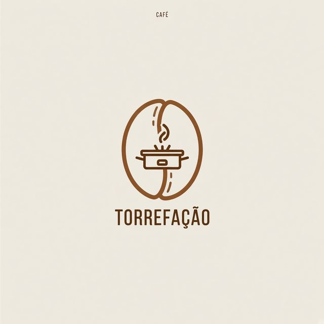</td>
</tr>
<tr>
<td colspan="2"><sub><code>/grok:edit Replace the word ROASTERY with TORREFAÇÃO and the small word COFFEE with CAFÉ. Keep everything else exactly the same. --image logo.jpg</code></sub></td>
</tr>
<tr>
<td colspan="2"></td>
</tr>
<tr>
<td colspan="2"><sub><code>/grok:overlay --image edit-after.jpg --text 'Star Party' --sub 'Friday, 9 pm · on the rooftop' --brand brand.json --style glass</code> · the brand file is <a href="docs/gallery/brand-example.json"><code>docs/gallery/brand-example.json</code></a></sub></td>
</tr>
</table>

### Animate a still, or start from words

`/grok:animate` asks for 720p, which came out as a real 1280×720. `/grok:video` makes the still first and animates it; `--draft` asks for Grok's 480p tier, a cheap way to check an idea.

<table>
<tr>
<td width="55%">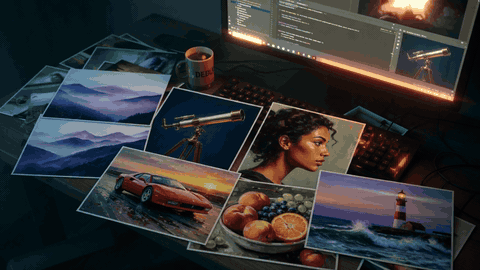</td>
<td width="45%">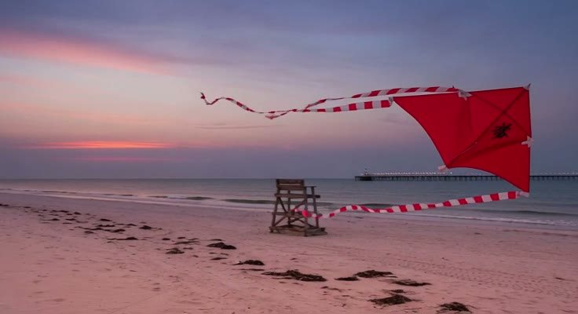</td>
</tr>
<tr>
<td><sub><code>/grok:animate slow camera push-in across the desk; steam rises from the mug and the monitor glow flickers softly --image hero.jpg</code> · 1280×720, 6 s</sub></td>
<td><sub><code>/grok:video a red paper kite drifting over a quiet beach at dusk --aspect 16:9 --draft</code> · a frame of the 736×400 draft</sub></td>
</tr>
</table>

### Direct a video from references

`/grok:ref-video` drives `reference_to_video`. Reference images appear in the prompt as `<IMAGE_0>`, `<IMAGE_1>`… and preset voices as `<AUDIO_0>`…; `--first-frame` and `--last-frame` pin the ends, `--keyframe PATH@SECONDS` pins the middle, and `--loop` uses one image as both first and last frame.

<table>
<tr>
<td width="25%">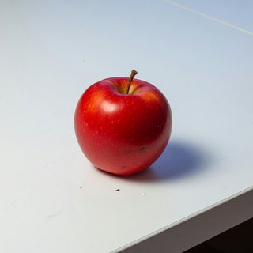</td>
<td width="25%">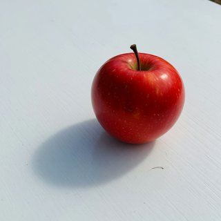</td>
<td width="50%">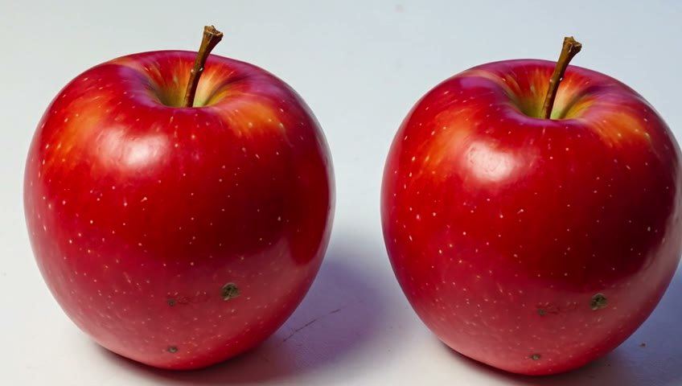</td>
</tr>
<tr>
<td colspan="3"><sub><code>/grok:ref-video '&lt;IMAGE_0&gt; and &lt;IMAGE_1&gt; side by side on a white table, slow camera push-in' --image apple-1.jpg --image apple-2.jpg --duration 4 --draft</code></sub></td>
</tr>
</table>

<table>
<tr>
<td width="50%">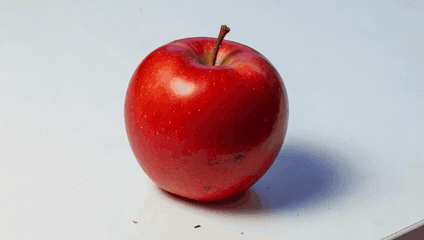</td>
<td width="50%">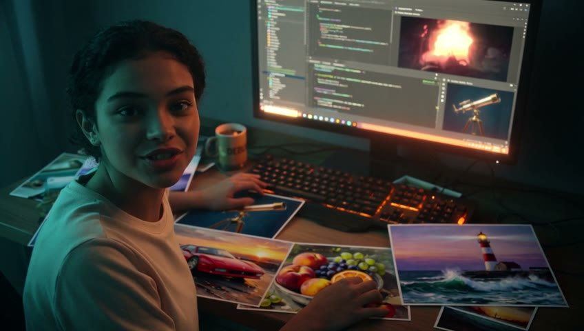</td>
</tr>
<tr>
<td><sub><code>/grok:ref-video 'a red apple slowly turning on a white table' --image apple-1.jpg --loop --duration 4 --draft</code> · first and last frames match (SSIM 0.96)</sub></td>
<td><sub><code>/grok:ref-video '&lt;IMAGE_0&gt; sets the scene: a young woman sits at this desk, turns to the camera and says in Brazilian Portuguese, in the voice &lt;AUDIO_0&gt;: …' --image hero.jpg --voice eve --duration 6 --draft</code> · the Portuguese line came out intelligible</sub></td>
</tr>
<tr>
<td colspan="2">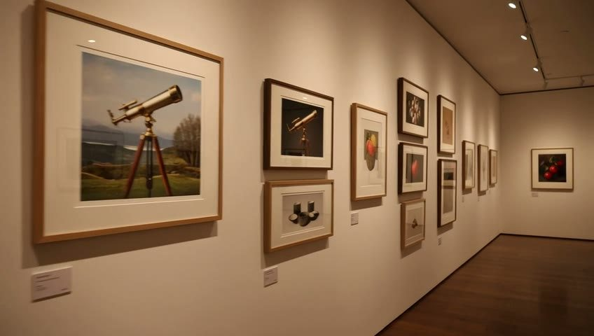</td>
</tr>
<tr>
<td colspan="2"><sub><code>/grok:ref-video 'a slow pan along a gallery wall showing &lt;IMAGE_0&gt;, … and &lt;IMAGE_7&gt; as framed prints' --image … (8 images) --duration 4 --draft</code> · eight references were accepted</sub></td>
</tr>
</table>

### Reframe for another screen

`/grok:reframe` turns a 16:9 piece into 9:16 (or any `W:H`) without AI: by cropping around an anchor, or by padding on a blurred copy of the picture itself. It works on images and clips.

<table>
<tr>
<td width="50%">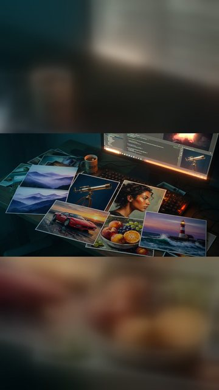</td>
<td width="50%">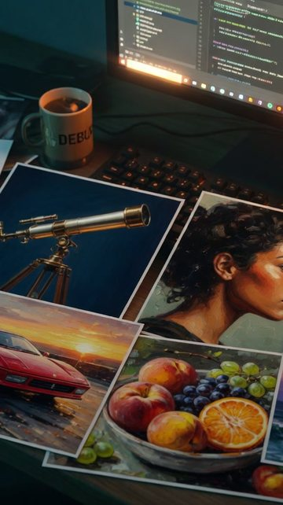</td>
</tr>
<tr>
<td><sub><code>/grok:reframe hero.jpg --aspect 9:16 --mode pad</code></sub></td>
<td><sub><code>/grok:reframe hero.jpg --aspect 9:16 --mode crop</code></sub></td>
</tr>
</table>

### Cut-outs and sheets

Stage a product or a character on flat green, then take it apart locally. `/grok:cutout` clears the background to transparency without a green fringe; `/grok:split` saves one transparent PNG per item, all on the same canvas, and `--expect` checks the count.

<table>
<tr>
<td colspan="2">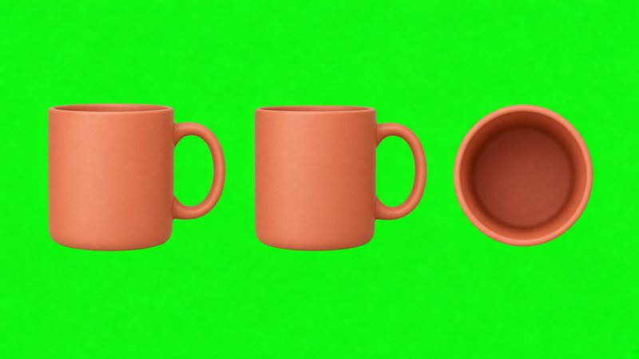</td>
</tr>
<tr>
<td colspan="2"><sub><code>/grok:image Product turnaround sheet of one matte terracotta ceramic coffee mug, shown three times in a single row… on a flat solid pure green #00FF00 background with even studio lighting. --aspect 16:9</code></sub></td>
</tr>
<tr>
<td width="50%">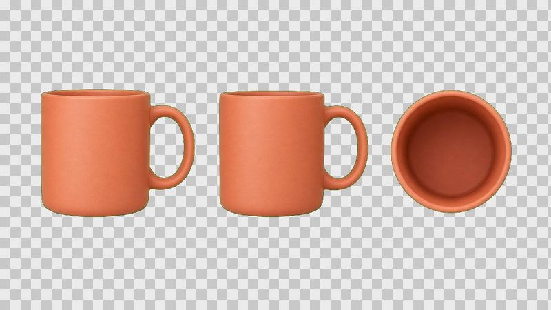</td>
<td width="50%">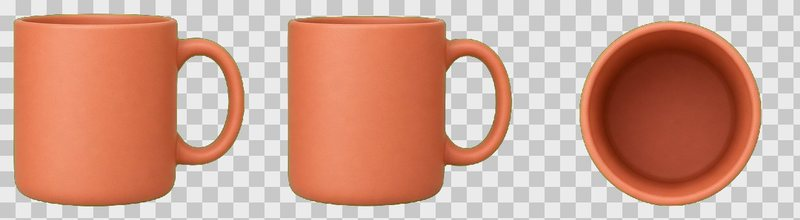</td>
</tr>
<tr>
<td><sub><code>/grok:cutout @last</code> · shown on a checkerboard</sub></td>
<td><sub><code>/grok:split @last --expect 3</code> · three PNGs, shown side by side</sub></td>
</tr>
</table>

### Variations

`--count` runs `image_gen` several times over one subject. There is no seed, so these are genuinely different takes rather than nudges of one image. That helps with concepting, and it is why a *recurring* subject has to come from editing a base image, or from `/grok:ref-video` with that image as a reference.

<table>
<tr>
<td width="50%"></td>
<td width="50%"></td>
</tr>
<tr>
<td colspan="2"><sub><code>/grok:image a minimalist flat-vector logo mark for a coffee roastery, single warm-brown color on cream --count 2 --aspect 1:1</code></sub></td>
</tr>
</table>

## Working with results

### Chaining with `@last` and `job:<id>`

Every generation and local tool names its job in its output (`jobId` with `--json`). Any file input then takes `@last` (the last file the plugin saved in this workspace, by a generation or a local tool), `job:<id>` (that job's first file) or `job:<id>#N` (its Nth file). A `video` job holds the still and the clip, so `job:<id>#1` is the still. The image inputs of `edit`, `animate` and `ref-video` also take a `data:` URL.

A longer piece, end to end, where only the Grok steps spend quota:

```bash
/grok:image a lighthouse on a rocky point at dusk, waves breaking --aspect 16:9 --name lighthouse
/grok:animate the beam sweeps across the sky, waves roll in --image @last --draft   # try the idea at 480p
/grok:animate the beam sweeps across the sky, waves roll in --image job:<image job>  # the keeper, at 720p
/grok:last-frame @last                                                              # its closing frame…
/grok:ref-video 'night falls over <IMAGE_0>, the camera pulls back' --first-frame @last --duration 6
/grok:concat job:<first clip> @last                                                 # …joins the two clips
/grok:reframe @last --aspect 9:16 --mode pad                                         # a vertical cut
/grok:mute @last                                                                    # and a silent one
```

### Where files go

Files land in `grok-media/` by default (`--out DIR` changes it). They are named from the prompt, the input file or `--name`, numbered, and never overwritten. `grok-manifest.json` records, for each file, the prompt actually sent, the tool that made it, and the aspect ratio, duration, resolution, draft flag, image model and cost Grok reported for the run.

The first time a run saves into a folder of a git repository that git does not ignore, the output says so, once per folder. The plugin never edits `.gitignore`.

### A project's library

For characters, mascots, products and brands that must stay consistent across pieces, keep one folder each under `grok-media/library/<name>/`:

- `canonical.jpg` (or `.png`): the reference image, fed as `--image` to `edit` and `ref-video`.
- `turnaround.jpg`: front, side and back views on green, and the separate views `/grok:split` makes from it.
- `traits.md`: what must not drift (face, proportions, outfit, colours, logo placement).
- `brand.json`: a brand's colours, fonts and logo, for `/grok:overlay --brand`.

```json
{
  "name": "Café Aurora",
  "colors": { "primary": "#C0392B", "secondary": "#F5E6CC", "accent": "#F1C40F", "text": "#FFFFFF", "background": "rgba(20, 10, 5, 0.6)" },
  "fonts": { "heading": "Playfair Display", "body": "Inter" },
  "logo": "logo.png"
}
```

`text` colours the title and `accent` the subtitle; `primary` fills the `bold` band; `background` and `secondary` make the `glass` panel and its border. A font is a Google Fonts family (loaded over the network when rendering) or a path to a `.ttf`, `.otf`, `.woff` or `.woff2` file, embedded so no network is needed. The logo path is relative to `brand.json`.

### Asking Claude instead

With the plugin installed you can ask in plain words, as in "use Grok to make a 9:16 clip of…". The `grok-generate` skill picks the command and its options, proposes a `--draft` first when a piece needs several clips, runs in the foreground, and reports the file with a one-line summary. It only acts when you name Grok, so a generic "make a video" is left to whichever tool you choose.

## Options

| Option | Meaning |
| --- | --- |
| `--out DIR` | Output directory (default `grok-media/`) |
| `--name SLUG` | Filename stem |
| `--aspect RATIO` | `image`/`video`: `1:1`, `16:9`, `9:16`, `3:2`, `2:3`, `auto`. `edit` takes a wider set, and only with 2+ images. `ref-video`: `1:1`, `16:9` (default), `9:16`, `4:3`, `3:4`, `3:2`, `2:3`. `animate` keeps the source's shape. `reframe` takes any `W:H` |
| `--count N` | `image`/`edit`: number of results, 1–8 |
| `--image PATH` | Input image of `edit` (repeatable), `animate`, `ref-video` (repeatable: the references) and `overlay`. Takes a path, `@last` or `job:<id>[#N]` |
| `--image-model M` | `image`/`edit`/`video`: `2.0` (default, `grok-imagine-image-2.0`), `quality`, `standard`, or `server` for xAI's current default |
| `--duration SECS` | `animate`/`video`: `6` (default) or `10`. `ref-video`: 1–15 (default 6) |
| `--resolution R` | `animate`/`video`/`ref-video`: `720p` (default) or `480p` |
| `--draft` | `animate`/`video`/`ref-video`: Grok's 480p tier, 6 s unless `--duration` says otherwise |
| `--background` | In a slash command, have Claude run the generation as a background job (see `/grok:status`) instead of waiting for it |
| `--model` · `--effort` | Grok model and reasoning effort |
| `--timeout SECS` | Run timeout: 30–3600 for Grok runs (`ask` brings a value outside that into range, the others refuse it); `overlay` takes 1–600 (default 60) |
| `--json` | Machine-readable output |
| `--verbatim=false` | Let Grok rewrite your prompt instead of passing it through |

`ref-video` has its own inputs (`--first-frame`, `--last-frame`, `--keyframe PATH@SECONDS`, `--voice ID`, `--loop`), and each local tool has a few options of its own (`--mode` and `--anchor` for `reframe`, `--reencode` for `concat`, `--key` and `--tolerance` for `cutout`, `--expect` and `--bg` for `split`, `--text`, `--sub`, `--brand`, `--position` and `--style` for `overlay`). Each command's argument hint lists them, and so does `node plugins/grok/scripts/grok-companion.mjs help`.

Options are checked before anything runs. A value the tool would reject (3 s, 1080p), or one of the plugin's options the command cannot use, is refused at once, with no job created and no quota spent, and the message names the fix. `ask` takes the options it always took and refuses the rest. A flag the plugin does not know at all (`--seed 5`) is not an option to it: a Grok command sends it to Grok as part of the prompt, and a local tool takes it for one of its inputs and stops.

## Real limits

Measured on Grok CLI 1.0.41, in the live runs of [`docs/live-tests.md`](docs/live-tests.md) and in the checks made just before them (the spec's §6), and enforced before Grok runs wherever the plugin can.

| | |
| --- | --- |
| **Images** | About 1K: 1024×1024 square, 1280×720 wide. One image per tool call; `--count` makes several calls. |
| **Edit references** | `image_edit` reduces every source image to about 768 px (~400 KB) before using it, so small text or a fine logo in a reference can be lost. Add exact text afterwards with `/grok:overlay`. |
| **Video resolution** | 720p or the 480p tier, nothing higher. 720p came out a real 1280×720 from a 16:9 still. "480p" is a tier, not 480 lines: `image_to_video` gave 736×400 from a 1280×720 still, and `reference_to_video` gave 848×480 at 16:9. 1080p is refused by the CLI itself (`resolution_name must be one of: 480p, 720p`); a plan's 1080p applies to the Grok app. |
| **Video length** | `animate` and `video`: 6 or 10 s. `ref-video`: 1–15 s. |
| **Sound** | Every clip is H.264 at 24 fps with an AAC soundtrack, always, plus an MJPEG cover picture as a second video stream. `/grok:mute` gives a silent copy. |
| **`ref-video` inputs** | The schema allows up to 14 reference images (7 on older CLIs, which `/grok:setup` detects); 8 were accepted live. Up to 3 preset voices and 4 keyframes. |
| **Time** | An image takes 15–35 s and a clip 45–65 s. |
| **Not available** | 1080p or 4K video, 2k images, native video editing or extension, stand-alone speech or music, cloned voices, 3D, seeds, negative prompts. |

## Things worth knowing

**Your prompt is passed through verbatim.** Grok's bundled `imagine` skill otherwise rewrites prompts, which quietly drops art direction you were explicit about. Pass `--verbatim=false` when you *want* it elaborated.

**There is no negative prompt**, and asking for the absence of something tends to summon it. The first attempt at the hero image above ended with `no visible text or logos` and came back with six QR codes across the photographs; naming what the photos *should* show fixed it in one pass. State what you want present, not what you want gone.

**There is no seed.** The same prompt gives a different image every time. For a consistent character or product, generate one base image and derive the rest with `/grok:edit`, or pass it to `/grok:ref-video` as a reference, and keep it in the project's library.

**There is no text-to-video tool.** Grok CLI 1.0 exposes `image_gen`, `image_edit`, `image_to_video` and `reference_to_video`, so `/grok:video` runs two steps, generating the opening frame and then animating it, and keeps both files.

**Media runs are isolated.** Each media command offers Grok only the tool it needs and turns off your Claude and Cursor skills, hooks, MCP servers and rules for that run. That keeps the agent on task, and cut one image run from 23.8 s to 14.7 s and from 58.6k to 26.1k tokens. Claude plugins themselves still load, since Grok has no switch for them, so every Grok process the plugin starts is marked, and the plugin refuses to start Grok again from inside one.

**Generations run in the foreground.** An image takes 15–35 s and a clip about a minute, so the commands wait and show the result. They go to the background only when you pass `--background` or ask for it, or for a batch. Nothing retries automatically.

**Quota.** On a Grok subscription, each run draws on the plan's weekly pool, which Chat, Imagine, Voice and Build share, `ask` included. Grok still reports what each agent turn would have cost ($0.012–0.027 per run in the live tests, mostly agent tokens rather than the media), and the manifest keeps that figure.

**Assets are harvested from Grok's session log,** not copied by the agent. Grok writes media under `~/.grok/sessions/<encoded-cwd>/<session-id>/`; the plugin reads `updates.jsonl` for the paths and copies the files out itself, which costs no extra turn and cannot be paraphrased away.

**Video fails on Zero Data Retention accounts.** If your xAI account has `coding_data_retention_opt_out: true`, every video call returns:

```
HTTP 400: Zero Data Retention teams must provide output.upload_url for video generation.
```

xAI requires ZDR callers to supply an upload destination, and the CLI exposes no such parameter, so the account setting has to change. Images and editing are unaffected, and `/grok:setup` reports this up front.

### Known limitations

- `--draft false` and `--duration 10 s` are read as prompt text, and `--draft=0` or `--draft=no` count as `--draft`.
- `/grok:setup` reads the plan from a settings cache whose format was never confirmed, so the plan may show as `unknown`. Nothing is blocked by it.
- The recursion guard recognises only Grok runs this plugin started, not a Grok session you open yourself with the plugin loaded.
- `ask` keeps 1.0.0's options and refuses the ones added in 2.0.0.

## Grok plugin vs Higgsfield

A short comparison with the Higgsfield skills for Claude Code, as they describe themselves in September 2026. This plugin trades range and ceiling for running on a subscription you may already have.

| | This plugin (Grok CLI) | Higgsfield skills |
| --- | --- | --- |
| **What each run draws on** | The Grok subscription's weekly pool, shared with Chat, Imagine, Voice and Build. No API key. | Higgsfield credits, per generation |
| **Models** | Grok Imagine only: Image 2.0 for stills, Grok's video tools | Many: GPT Image 2.5, Nano Banana, Soul, Seedance, Kling, Veo and others |
| **Video ceiling** | 720p; 6 or 10 s from a still, 1–15 s from references | Seedance 2.5 up to 1080p and 4–30 s; 4K with Seedance 2.0 |
| **Consistency** | Reference images, pinned first/last frames and keyframes in `ref-video`; edits from a base image | Soul ID (a trained identity), reference-driven models |
| **Audio** | Every clip comes with generated sound; preset voices only in `ref-video`. No audio on its own | Stand-alone audio: voice, music-like audio and sound effects |
| **Video editing** | None native. Last frame → new clip → `concat`, and `reframe`, run locally | Edit, extend and reframe workflows |
| **Exact text** | Image 2.0 for short text, `/grok:overlay` for anything that must be exact | GPT Image 2.5 for on-image text |
| **Beyond that** | `cutout` and `split` locally | 3D, ad and product-photo studios, marketplace cards, thumbnails, Virality Predictor |
| **Where results go** | Files in your workspace, with a manifest | Hosted URLs |

## Requirements

- **Grok CLI**, signed in: install it from [x.ai/build](https://x.ai/build), then run `grok login`. Runs count against your xAI account; on a Grok subscription they draw on the plan's weekly pool.
- **Node.js 18.18+**
- Optional, for the local tools. Nothing is installed for you, and a missing one is named when a tool needs it:
  - **ffmpeg** (with ffprobe) for `last-frame`, `concat`, `mute` and `reframe`.
  - **Python 3 with Pillow, numpy and scipy** for `cutout` and `split`. `GROK_PLUGIN_PYTHON` picks another interpreter than the `python3` on your PATH.
  - **Google Chrome or Chromium** for `overlay`. The plugin looks for the macOS app, then `google-chrome` or `chromium` on the PATH; `CHROME_PATH` points it at a specific binary. It always runs headless with a throwaway profile and never touches your Chrome profile or keychain.

### Switching from the original plugin

The fork's marketplace is named `madebysandro-grok`, not `grok-plugin-cc` like the original's, so the two marketplaces can be added side by side. Both offer a plugin named `grok` with the same `/grok:*` commands, though, so keep only one installed: to switch from the original, uninstall it first (`/plugin uninstall grok@grok-plugin-cc` in Claude Code, `codex plugin remove grok@grok-plugin-cc` in Codex).

## Development

```bash
npm test        # no network, no Grok CLI; tests that need ffmpeg, Python or Chrome skip without them
```

The companion is also a plain CLI:

```bash
node plugins/grok/scripts/grok-companion.mjs help
node plugins/grok/scripts/grok-companion.mjs setup
node plugins/grok/scripts/grok-companion.mjs image "a red apple" --out ./shots --json
```

Layout:

```
plugins/grok/
  commands/     slash commands
  agents/       grok-media subagent
  skills/       grok-generate, grok-cli-runtime, grok-imagine-prompting, grok-media-results
  scripts/
    grok-companion.mjs
    chroma.py          cutout and split (Pillow, numpy, scipy)
    lib/
      grok.mjs         CLI discovery, running Grok headless, auth, plan and ZDR detection
      invocation.mjs   the command line and environment of each Grok run
      media-spec.mjs   what each media tool accepts, checked before Grok runs
      prompts.mjs      the instruction templates sent to Grok
      session.mjs      session-log parsing and media-call extraction
      assets.mjs       copying assets out, naming, manifest
      refs.mjs         @last and job:<id>[#N] inputs
      compat.mjs       setup's zero-cost checks against Grok's sessions on disk
      readiness.mjs    the setup report
      local-tools.mjs  the local tools, on ffmpeg.mjs, chroma.mjs and overlay.mjs
      ffmpeg.mjs       ffmpeg and ffprobe
      chroma.mjs       running chroma.py
      overlay.mjs      the overlay page, from the options and brand.json
      html-render.mjs  headless Chrome, HTML to PNG
      git-notice.mjs   the one-time note about media git would pick up
      state.mjs        per-workspace job tracking
      render.mjs       output formatting
      args.mjs         argv parsing
```

The design notes for this release are in [`docs/spec-paridade-higgsfield.md`](docs/spec-paridade-higgsfield.md) (in Portuguese).

## Fork notes and license

This is [`madebysandro/grok-plugin-cc`](https://github.com/madebysandro/grok-plugin-cc), a fork of [`arielaizn/grok-plugin-cc`](https://github.com/arielaizn/grok-plugin-cc) by **Ariel Aizenshtat**, who wrote the original plugin (1.0.0), itself built in the shape of [`openai/codex-plugin-cc`](https://github.com/openai/codex-plugin-cc). Version 2.0.0 is the fork's first release: it aims for the experience of the Higgsfield skills (a few generation commands, local tools that need no AI, and a router skill Claude follows) on a Grok subscription alone. Every change is in the [CHANGELOG](plugins/grok/CHANGELOG.md).

MIT; see [LICENSE](LICENSE), which keeps the original copyright notice.

Not affiliated with xAI, OpenAI or Higgsfield. "Grok" is a trademark of xAI.
